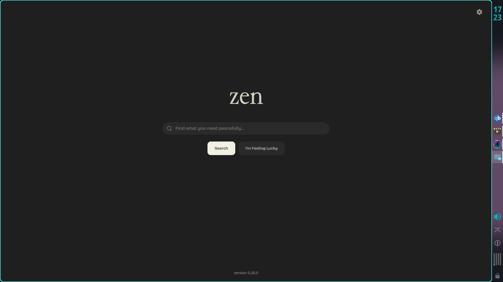
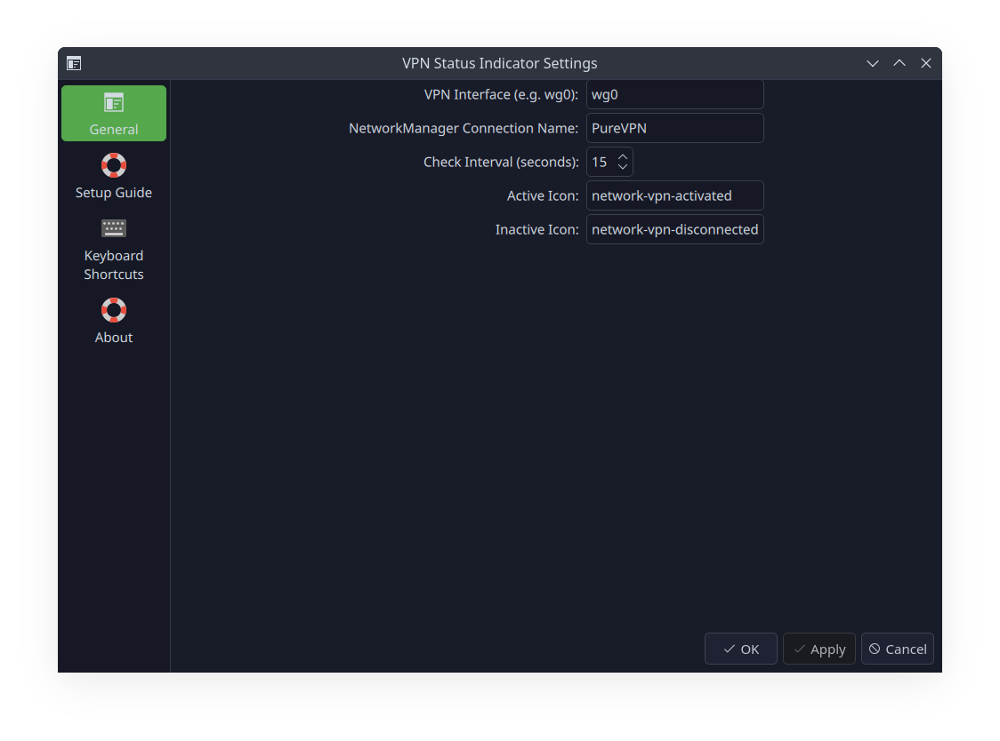
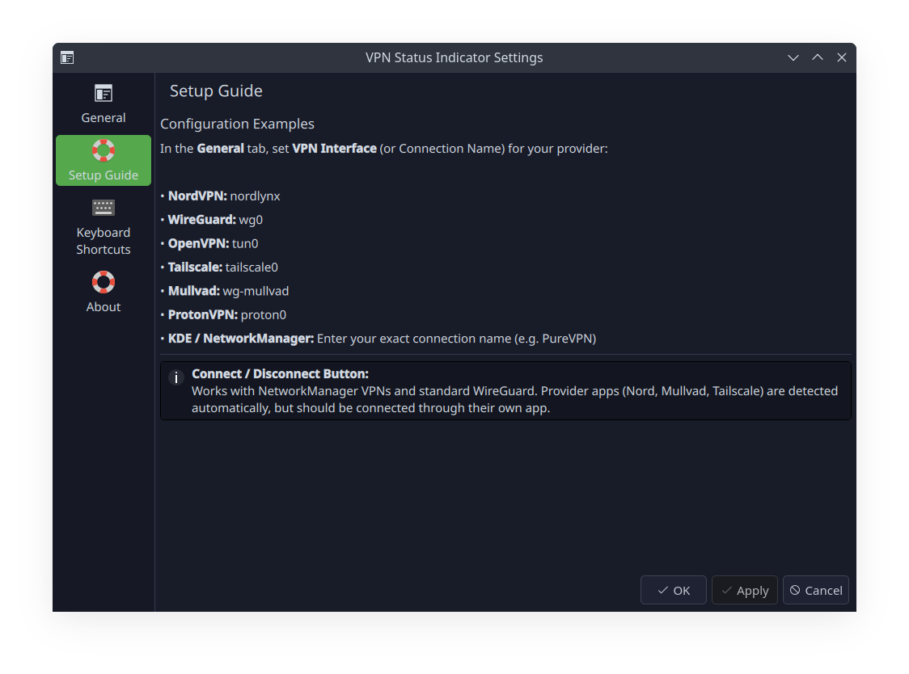

# VPN Status Indicator

[](https://kde.org/plasma-desktop/)
[](https://doc.qt.io/qt-6/qtqml-index.html)
[](https://github.com/PlasmaDrifter/Widget-vpnindicator/releases)

A fast, lightweight KDE Plasma 6 widget that monitors your VPN connection status with live visual indicators and one-click toggle functionality.

> [!NOTE]
> **Questions, custom configs, or ideas?** Join us on Reddit at <nobr>[**r/PlasmaDrifterProjects**](https://reddit.com/r/PlasmaDrifterProjects)</nobr>!






## Features

- **Live Status Indicator**: Dynamic colored icon in your panel showing connected vs. disconnected states at a glance.
- **Detailed Popup View**: Click to expand a dashboard card showing the current VPN interface, connection name, and status.
- **One-Click Connect/Disconnect**: Native toggle button for NetworkManager-configured VPNs and WireGuard.
- **Dual-Engine Detection**: Seamlessly detects both Linux kernel interfaces (`/sys/class/net/*`) and NetworkManager active connections.
- **Zero Network Overhead**: Uses local in-memory sysfs and D-Bus IPC checks — **no ICMP ping traffic or external network requests**.
- **Configurable Polling**: Adjustable update interval and customizable system icons.

---

## Installation

### Option 1: Download from GitHub Releases (Recommended)
Download the latest `local.widget.vpnindicator.plasmoid` from the [Releases page](https://github.com/PlasmaDrifter/Widget-vpnindicator/releases), then install:
```bash
kpackagetool6 -i local.widget.vpnindicator.plasmoid
```

### Option 2: Git Clone
```bash
git clone https://github.com/PlasmaDrifter/Widget-vpnindicator.git ~/.local/share/plasma/plasmoids/local.widget.vpnindicator
```

Then right-click your desktop or panel → **Add Widgets…** → search for **VPN Status Indicator**.

---

## Configuration Settings

Right-click the widget → **Configure VPN Indicator…**

| Setting | Description | Default |
|:---|:---|:---|
| **VPN Interface** | Virtual network interface created by your VPN (e.g. `wg0`, `nordlynx`, `tun0`, `tailscale0`). | `wg0` |
| **NetworkManager Connection Name** | Exact connection name defined in KDE Network Settings (e.g. `PureVPN`, `NordVPN`). | `PureVPN` |
| **Check Interval** | Polling frequency in seconds. | `15` |
| **Active Icon** | System icon displayed when connected. | `network-vpn-activated` |
| **Inactive Icon** | System icon displayed when disconnected. | `network-vpn-disconnected` |

---

## 🛠️ VPN Setup Guide by Provider

### 1. NetworkManager / KDE Built-in VPN (Recommended)
*Best for: PureVPN, OpenVPN, WireGuard configs imported directly into KDE System Settings.*

1. Open **System Settings → Wi-Fi & Networking → Connections**.
2. Note the exact name of your VPN connection (e.g. `PureVPN` or `Work VPN`).
3. In the widget settings:
   - Set **NetworkManager Connection Name**: `PureVPN` (match exact case).
   - Set **VPN Interface**: `wg0` or `tun0` (or leave blank if using Connection Name).
4. **Result**: Both automatic status detection and the **Connect / Disconnect toggle button** work natively without root passwords.

---

### 2. NordVPN (Official Linux App / CLI)
*Best for: Users running the official `nordvpn` daemon (`nordvpn connect`).*

1. In the widget settings:
   - Set **VPN Interface**: `nordlynx` *(Default WireGuard protocol in NordVPN)*.
   - *(If you configured OpenVPN via `nordvpn set technology openvpn`, set to `tun0`)*.
   - Leave **NetworkManager Connection Name** blank.
2. **Result**: The indicator automatically turns green/active when NordVPN connects and gray when disconnected.
3. *Note on Toggling*: Because the official Nord app runs via its own background daemon (`nordvpnd`), start and stop connections using `nordvpn connect` / `nordvpn disconnect` or the Nord system tray icon.

---

### 3. Standard WireGuard (`wg-quick`)
*Best for: Manual WireGuard tunnels managed via system commands or systemd.*

1. In the widget settings:
   - Set **VPN Interface**: `wg0` (or whatever your `.conf` file is named in `/etc/wireguard/`).
   - Leave **NetworkManager Connection Name** blank.
2. **Toggle Button Support**: If you want the widget button to run `wg-quick up/down`, ensure your user has passwordless sudo permission for `wg-quick`:
   ```bash
   # In /etc/sudoers.d/wireguard
   yourusername ALL=(ALL) NOPASSWD: /usr/bin/wg-quick
   ```

---

### 4. Tailscale
*Best for: Tailscale mesh VPN users.*

1. In the widget settings:
   - Set **VPN Interface**: `tailscale0`.
   - Leave **NetworkManager Connection Name** blank.
2. **Result**: Automatically detects when your Tailscale node is active.

---

### 5. Mullvad VPN
*Best for: Mullvad official desktop client or standalone WireGuard.*

- **If using the Mullvad Desktop App:**
  - Set **VPN Interface**: `wg-mullvad` (WireGuard) or `tun-mullvad` (OpenVPN).
- **If using Mullvad WireGuard configs via KDE Network Settings:**
  - Set **NetworkManager Connection Name** to your connection name.

---

### 6. ProtonVPN
*Best for: ProtonVPN Linux client or WireGuard/OpenVPN profiles.*

- **If using the ProtonVPN App:**
  - Set **VPN Interface**: `proton0`.
- **If using Proton configs imported into KDE:**
  - Set **NetworkManager Connection Name** to match the profile in KDE settings.

---

## ⚡ Quick Reference Cheat Sheet

| VPN Provider / Type | VPN Interface | Connection Name | Toggle Button Supported? |
|:---|:---|:---|:---:|
| **KDE NetworkManager** | *(optional)* | Exact name in KDE | ✅ **Yes** |
| **NordVPN CLI / App** | `nordlynx` (or `tun0`) | *(blank)* | Connect via `nordvpn c` |
| **WireGuard (`wg-quick`)** | `wg0` | *(blank)* | ✅ **Yes** (with sudo rights) |
| **Tailscale** | `tailscale0` | *(blank)* | Connect via `tailscale up` |
| **Mullvad App** | `wg-mullvad` | *(blank)* | Connect via Mullvad App |
| **ProtonVPN App** | `proton0` | *(blank)* | Connect via Proton App |
| **Generic OpenVPN CLI** | `tun0` | *(blank)* | Connect via `openvpn` |

---

## Requirements

- **KDE Plasma**: 6.0 or higher
- **NetworkManager** (`nmcli`) or **WireGuard** (`ip` / `wg-quick`)

---

## 💬 Community & Discussions

Got questions, setup ideas, or feedback?

* 🌐 Join our subreddit at [**r/PlasmaDrifterProjects**](https://reddit.com/r/PlasmaDrifterProjects) to discuss updates, get support, and share configurations.
